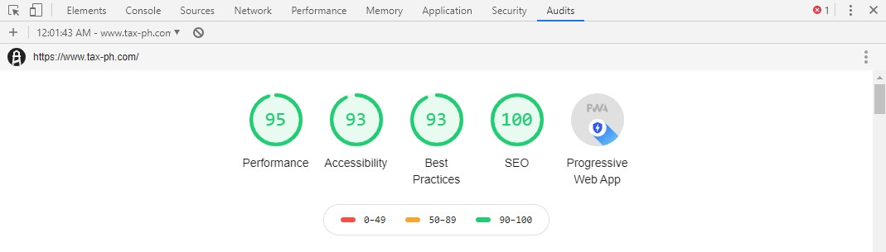

# Philippine Tax Calculator

Simple tax calculator using Vuejs + UIKit3

[](http://paypal.me/jjquiazon)

url: https://www.tax-ph.com


## Google's Lighthouse Score ##



## Features ##

* 2 Calculator Type:
  * Tax Calculator - straightforward calcuations based on annual, monthly, semi monthly, weekly or daily salary
  * Payroll Calculator - precise calculator with flexible options like: working weekdays, distributions of monthly contributions, toggle holidays in calendar, income and deductions.
* Withholding Tax Result from 2018-2022 & 2023 formula
* Vuex modules
* UIKit3 with SASS
* (PWA) Progressive Web Application 
  * Service Worker for Offline mode
  * Mobile-friendly meta-viewport
  * Web Application Manifest + favicons

## Online Resources ##

1. [PWABuilder](https://www.pwabuilder.com/imageGenerator) - Quickly and easily create app icons for various platforms in the right size and format.

## Includes ##

* [UIKit](https://getuikit.com/) A lightweight and modular front-end framework for developing fast and powerful web interfaces.
* [Vue.js](https://vuejs.org/) The Progressive JavaScript Framework.
* [Vue CLI 3](https://cli.vuejs.org/) Standard Tooling for Vue.js Development.
* [Vue-Router](https://router.vuejs.org/en/) Vue Router is the official router for Vue.js.
* [Vue-Meta](https://github.com/declandewet/vue-meta) Manage page meta info in Vue.
* [Vue-Analytics](https://github.com/MatteoGabriele/vue-analytics) Google Analytics plugin for Vue.

## Installation
```
git clone https://github.com/jioo/tax-calculator.git
cd tax-calculator

# Install Dependencies
npm i

# Compiles and hot-reloads for development
npm run serve

# Build production and serve in HTTP server
npm run build
```
